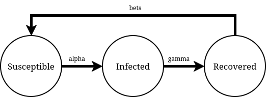
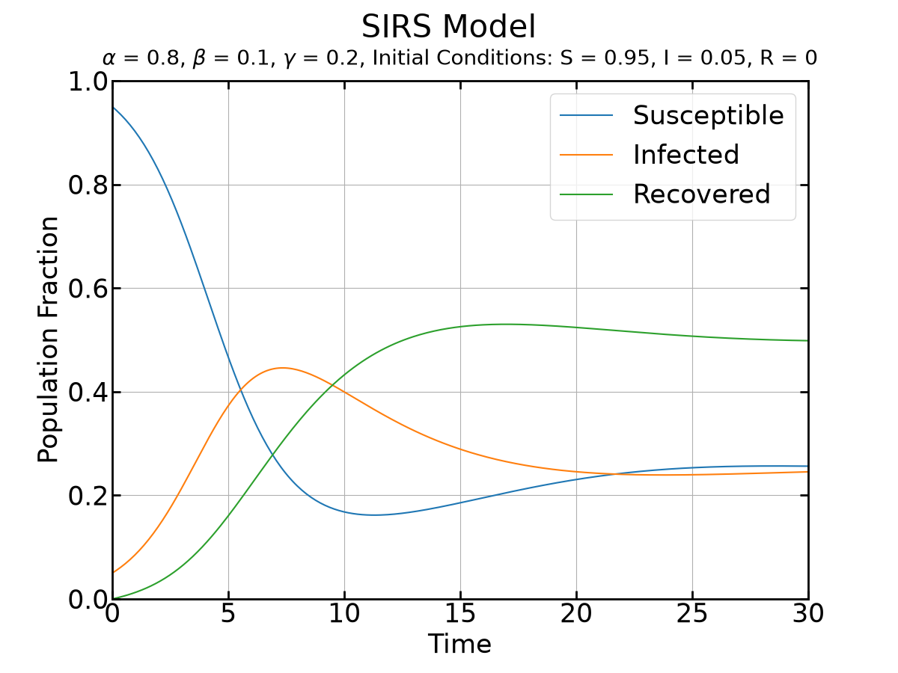

# Solving ODEs using Python: SIRS Example

#### Richard Hill

### Preface

The goal of this example is to provide some code to get you, yes you, the next great math modeler, started with solving ordinary different equations with Python. The example I will specifically use is the susceptible, infected, recovered, and susceptible (again). This model is used within our ODE class as a great problem to work through, and allows many expansions to make it more accurate. In fact, the second susceptible is already an addon! It makes the graphs more interesting, thus I included it here.

### Requirements

- A tad of Python (or willingness to learn!)
- Pycharm from JetBrains (yes other integrated dev enviroments work, but this is the standard one used by WLC CS department)
- A linux, Mac, or Windows computer (Chromebooks are out, unless you find an online alternative, i.e Google Colab, etc...)
- A problem to tackle (ooooo look one is right here!)

### SIRS

 The susceptible, infected, recovered, and susceptible (again) model is a very tackalable, tacklable.... a very viable problem to be solved within Excel. This can be done with sum of squared errors and a very slick addon that includes an optimizer, but that requires work.... we, as of now, are semi computer scientist. If we have to do it once in Excel, there is a good chance it could be a lot faster by writing some code (especially if it's a monotonous task that must be done over and over again). Along with this, expanding the model with more addons becomes much more easy and the scope of what can be added expands greatly!

$$\frac{dS}{dt} = -\alpha SI + \beta R$$ 
$$\frac{dI}{dt} = -\gamma I + \alpha SI$$
$$\frac{dR}{dt} = -\beta R + \gamma I$$ 

where 

$$\alpha \text{ is infection coefficient}$$
$$\gamma \text{ is recovery coefficient}$$
$$\beta \text{ is immunity coefficient}$$

### Assumptions

1. There are some infected to begin with
2. Net population isn't changing
3. Constants are indeed constant and not changing
4. etc

### Getting Started with JetBrains

- Make a folder on your computer (organize!)
- Open Pycharm and select the folder
- Create a Python virtual environment
- Make a main.py file
- Begin to code!!!

### Example Output from Program

